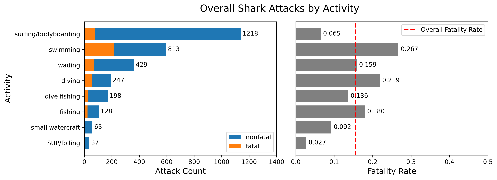
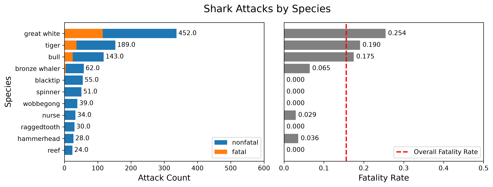
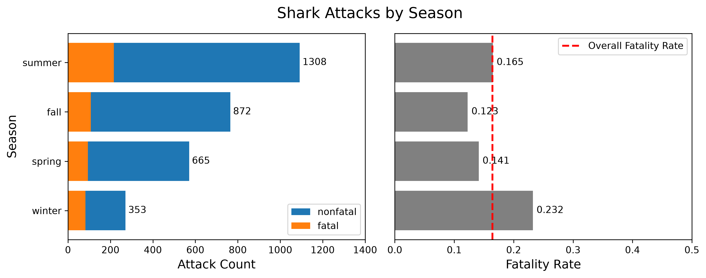
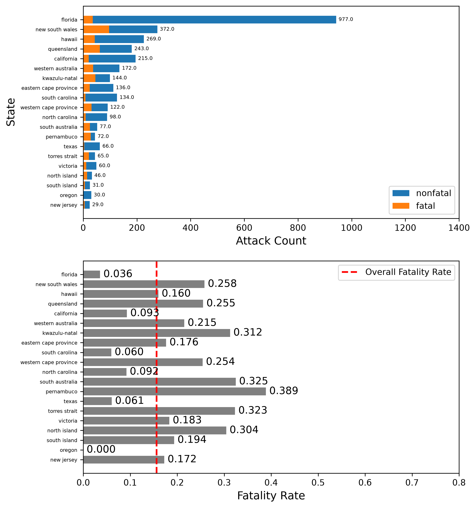
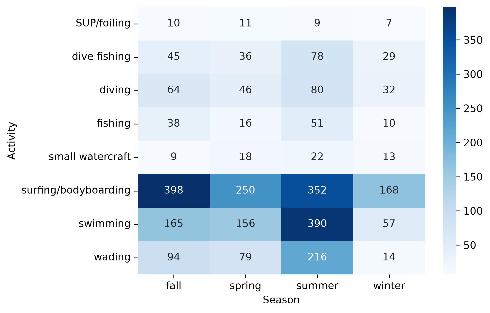
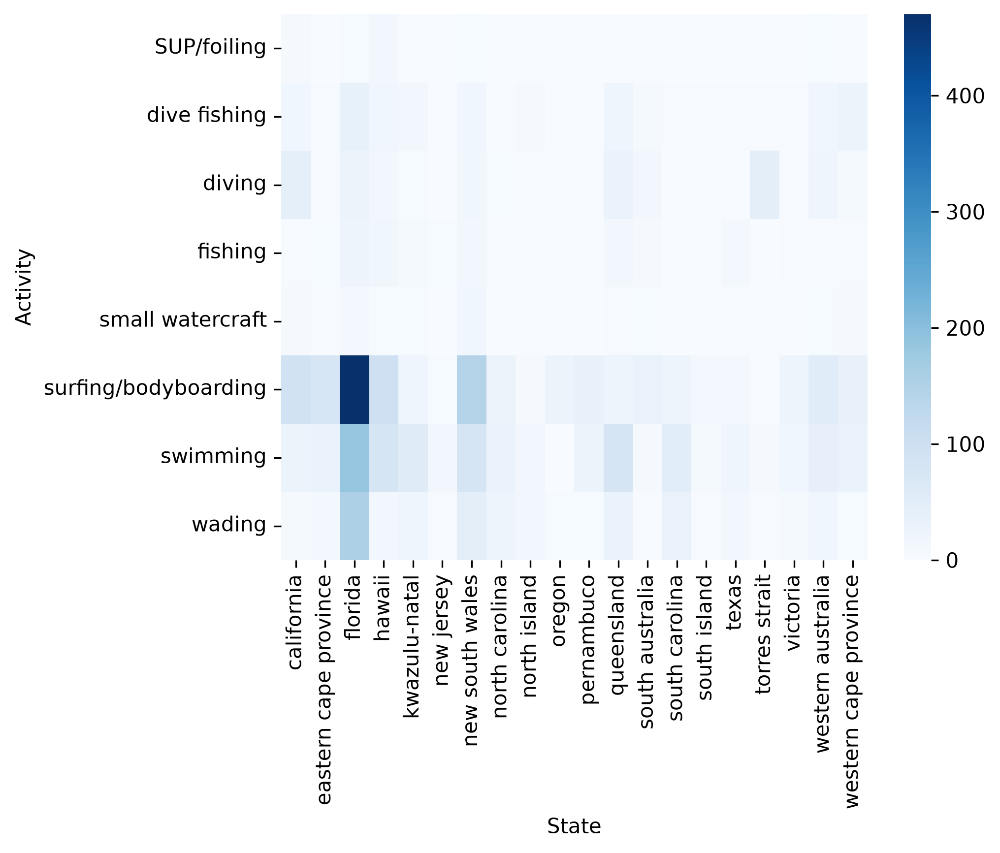
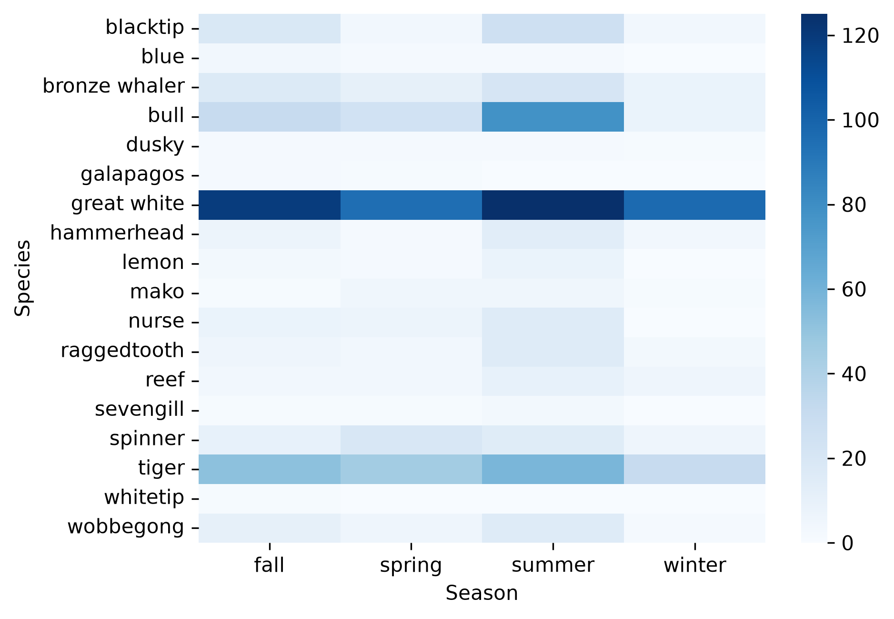
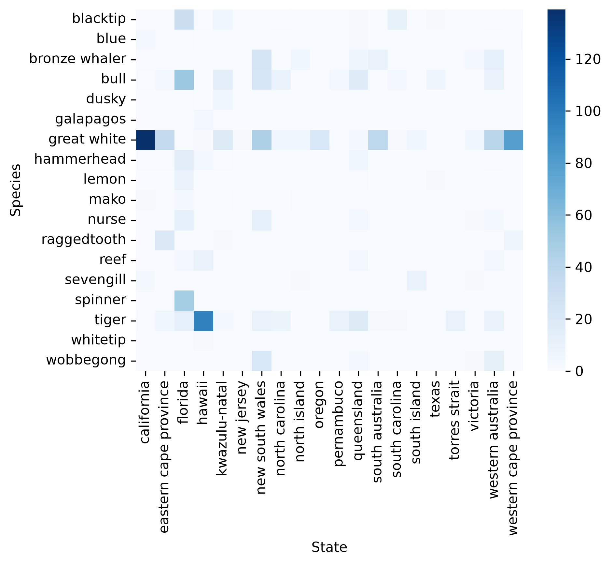
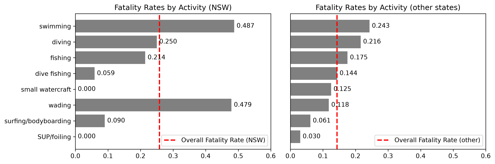
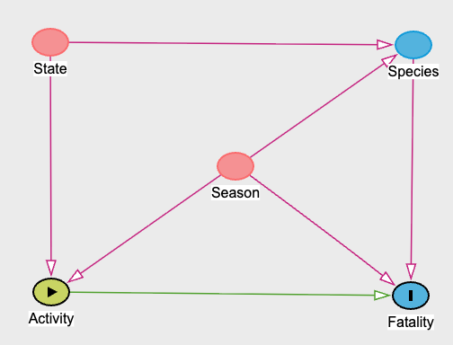

## Introduction {#sec-1}

The fear of shark attacks shapes the relationship many people have with the ocean, often keeping some of them away from it entirely. Due to their rarity, people’s perception and understanding of shark attacks are almost entirely shaped by stories and their depiction in media. This understanding has real-life consequences for recreation at the beach. @neff2015jaws introduces the idea of the “Jaws Effect” and argues that fictional depictions of shark attacks become the basis for explaining real-life events by political actors who influence policy. The way shark attacks are portrayed in media often suggests the intentionality of the shark, villifying the animal. More importantly for our analysis, shark attacks in media often reinforce the idea that encounters with sharks lead to fatal outcomes. Our analysis in later sections will push back against this idea, instead showing the majority of shark attacks (let alone shark encounters) are not fatal. Nonetheless, the portrayal of sharks as inherently evil and lethal animals shapes policy and may be one of the reasons nearly 100 million sharks are killed by humans each year, as detailed by @worm2013global. Data analysis can unearth findings that create a more accurate understanding of sharks and their interactions with humans. Such an understanding could then be used by policymakers to keep humans and sharks safer through education, warnings, and even physical solutions such as shark nets and drone spotters.

There is existing literature conducting a variety of analyses on the Global Shark Attack File (GSAF), including some that focus on the fatality rates of shark attacks. @ricci2016shark examines the type of injuries that arise from shark attacks and even goes so far as to investigate which characteristics of an attack lead to severe injuries and death. One such attack characteristic is the activity of the victim at the time of the attack (identifying swimming as the most lethal activity). @de2021factors go a step further, looking at shark attacks in Brazil. They investigate other factors such as region, demographic information, and even temporal variables such as time of year. Such studies are useful. However, they do not go beyond an associational analysis of the factors contributing to fatal shark attacks. This paper aims to go beyond associational analysis and conduct a causal analysis of the variables that influence the survivability of shark attacks. Ultimately discovering which factors truly cause shark attacks to be deadly.

This paper primarily focuses on one shark attack characteristic, the activity of the victim at the time of attack. While @ricci2016shark and @de2021factors both identify activity as a contributing factor to shark attack survivability, neither quantifies the causal change in survivability by choosing to partake in one activity over others. Activity is one of the only characteristics of an attack listed in the GSAF that is truly a choice of the victim, and is therefore one of the variables a potential victim would have the most control over. Enabling people with accurate data relating to activity and shark attack survivability would allow them to make the most informed choice while having a nearly complete understanding of the risks associated with their chosen activity.

## Exploratory data analysis {#sec-2}

Data for this project is from the Global Shark Attack File ([GSAF](https://www.sharkattackfile.net/incidentlog.htm)). The GSAF is maintained by the Shark Research Institute and has over 5000 records of shark attacks dating all the way back to the 17th Century. While an invaluable resource for the study of shark attacks, there are multiple concerns with this dataset. First and foremost is the selection bias of what attacks actually end up recorded in this dataset. The majority of attacks recorded in the GSAF are from the United States and Australia, which are wealthy, populous, and developed nations. Attacks in these countries are highly publicized and have the ability to be easily reported through media such as print and the internet. Nations that are less developed, particularly those in the South Pacific and the global south as a whole, likely have a more difficult time reporting and communicating attacks in such a way that they would ultimately end up in the GSAF. One should assume that there is a lack of reported attacks from less developed countries that end up in the GSAF, especially as one looks further back in time. Other concerns exist within the dataset itself. Many of the records in the GSAF are missing data for one or more attributes of a given attack (e.g., missing date and/or species). Additionally, the data itself can be quite messy. Many records contain typos and descriptions of attributes that can be vague or hyper-specific. This section details how the data was prepared for subsequent analysis.

### Data preparation

The raw data was downloaded from the GSAF. This data was then cleaned using scripts that can be found in the code folder included in the GitHub repository that is linked at the top of this page. This cleaning included selecting which columns to keep for analysis. Of those columns kept, several mapped descriptive strings to categories. For example, the script would look for keywords in the description such as “surfing”, “surboard”, or “boogieboard” and map them to the category “surfing/bodyboarding”. A similar process was performed to turn data in the “state” and “species” columns into categorical variables. The resulting clean data was then filtered for records that cleanly mapped to activities of interest and had non-null values for fatality. Lastly, columns were added for hemisphere in order to ultimately add a column specifying the season in which an attack occurred.

This data was then further filtered down according to geographic area. First only the top ten countries by attack count were kept, the top 10 countries account for 79% of all attacks recorded in the GSAF (leaving 4099 records). However, country will not work as a variable for location by itself as it is too vague. For example, both California and Flordia are in the United States yet have very different climates and shark species present. This data was then further filtered down to states (including state-like territories in other countries) in order to get more granular location data. These states were then further filtered down to states that had at least 30 attacks recorded in the GSAF. This left 20 states remaining in the dataset, statistics on this cleaned and filtered dataset can be seen below.

- Total number of attacks: 3358
- Number of fatal attacks: 524
- Number of nonfatal attacks: 2834
- Overall fatality rate: 15.60%

### Fatality rates by different attributes

#### Analysis of activity

Figure 1 shows the count of shark attacks and fatality rates for different activities. The overall fatality rate of 15.6% is shown on the rate visualization as a dashed red line.

{#fig-1 width="100%"}

If activity were to have no effect on fatality rate, one would expect the fatality rate of each activity to be around the overall fatality rate. Figure 1 shows that this is not the case. This is confirmed by a chi-square test for independence that results in a p-value of less than $1.2 \times 10^{-33}$, suggesting activity and fatality are not independent. While this is a strong result arising from a simple associational analysis, we aim to go beyond this result to move towards the asymptote of causality and attempt to quantify the causal effect of activity. This begins with identifying some possible confounding variables.

#### Analysis of species

The first possible confounding variable we analyze is species, the results of the same analysis performed for activity in relation to fatality rates are shown in Figure 2.

{#fig-2 width="100%"}

Species appears to have a strong affect on survivability when compared to activity. With some species such as blacktip and spinner sharks having no recorded fatal attacks in this subset of the dataset. On the other hand, the fatality rate of attacks by great whites (25.4%) is well above the overall fatality rate of 15.6%. A chi-square test between species and fatality yields a p-value less than $3.6 \times 10^{-12}$, further suggesting the two variables are not independent. 

#### Analysis of season

Next, we take a look at shark attacks by season in Figure 3.

{#fig-3 width="100%"}

These results show that despite a significantly lower number of attacks, winter has the highest fatality rate of all seasons at 23.2%. A chi-square test between season and fatality rate suggests the two variables are not independent (<$2 \times 10^{-5}$). There could be several reasons for the fluctuation in fatality rate across the seasons. One such possibility is which sharks are present close to shore around people during each season. Juvenile sharks tend to spawn during the warmer months in the Spring and Summer, which is also when more people tend to seek the beach for recreation. These juveniles are small and less likely to inflict the type of wound that could lead to a fatality. On the other hand, due to migration patterns, larger sharks may be present closer to shore in populated areas like California and off the coast of Australia. These encounters tend to be deadlier, as shown in Figure 2.

#### Analysis of location (state)

As mentioned by @midway2019trends, a number of local conditions affect the number of shark attacks and shark related deaths in a given region. The conditions include the local population level and the species of shark present. We take a look at shark attacks and fatality rates by state in Figure 4.

{#fig-4 width="100%"}

As can be seen in Figure 4, the fatality rates of each state in the dataset tend to vary far from the overall fatality rate. Florida, which has a disproportionately high rate of shark attacks, has a low fatality rate of 3.6%. The state with the second highest number of shark attacks, New South Wales in eastern Australia, has a fatality rate of 25.8%, which is well above the overall fatality rate of 15.6%. State and fatality rate are shown not to be independent with a chi-square test that yields a p-value of less than $5.5 \times 10^{-51}$. This disparity in fatality rates can likely be explained by the different species present in each state. Florida features predominantly small shark species such as bull sharks, while Australia is known for its larger population of great white sharks. This idea will be explored further in subsequent sections.

### Exploring relationships between confounding variables and activity

- include contingency tables
- compare stats for different species/states/seasons

While the previous section focused on relationships between the confounding variables we have identified (location, season, and species) and fatality rates, this section focuses on relationships among confounding variables and activity. This will be important when constructing our probabilistic graphical model in the subsequent sections. By understanding how the confounding variables interact with activity, we can begin to construct pathways of causality through these confounders to the probability of fatality.

#### Activity and season

It seems reasonable to guess that the season can influence the activity being performed in which a shark attack took place. For example, winter typically comes with stronger storms which generate larger waves. These conditions are great for surfers, less so for swimmers (especially when also factoring in the cold). We look to figure 5 to see if this assumption has any merit.

{#fig-5 width="60%"}

Figure 5 indeed shows fluctuations in each activity by season as well as changes in their proportions in relation to each other by season. Winter months bring cold weather and cold water, and thus see precipitous drops in swimming and wading. During these months, someone who is attacked is more likely to be surfing than swimming/wading. This trend flips during the summer, in which more people come to the beach for casual recreation, bringing a spike in attacks on swimmers and waders relative to surfers.

#### Activity and location

{#fig-6 width="60%"}

Figure 6 shows counts of attacks based on activity and state. The popularity of activities varies by state, with surfing being the most popular in some states and swimming being the most popular in others. This could be due to several factors, such as the local culture and the conditions for each activity in the region.

#### Season and species

{#fig-7 width="60%"}

The heatmap in Figure 7 shows fluctuations in attacks by different species across seasons. For nearly all species, more attacks occur in the fall and summer months. Bull sharks stand out, as a higher proportion of bull shark attacks occur during the summer months when compared to other species in relation to other seasons.

#### Location and species

{#fig-8 width="60%"}

Figure 8 demonstrates the differences in distribution of shark species across regions (states). California stands out for having nearly every single attack be due to a great white shark. Other states, such as Florida, see a wider variety of shark species involved in attacks that are typically associated with lower death rates. This helps explain the disparity in fatality rates across states shown in section 2.2.4. This plot shows a strong relationship between state and the shark species present during attacks.

## Moving toward causality: how confounders influence treatment effect {#sec-3}

For the purposes of this study, we would like to investigate the effect confounding variables may have on the associational correlation we observed between activity and fatality rate. The confounding effect of location is made clear in Figure 9 below.

{#fig-9 width="100%"}

The overall fatality rate in New South Wales is 25.8%, while the overall fatality rate across all other states in our analysis is 14.3%. Fatality rates across activities are generally higher across the board in New South Wales. The fatality rate of attacks on swimmers in New South Wales is more than twice that of all other states when combined. More importantly, the relative danger of each activity compared to other activities is different in New South Wales. This is most obvious when looking at the fatality of wading. Attacks on people in shallow water in New South Wales are dramatically higher than other activities except for swimming. This is very different from the rest of the population as a whole, where wading tends to have a lower fatality rate than the majority of other activities.

These results show that activity alone does not adequately capture the risk of death when attacked by a shark, and the location of the attack is indeed a confounding variable that must be accounted for when trying to measure the causal effect of activity on shark attack survivability

## Modeling with a probablistic graphical model {#sec-4}

{#fig-10 width="40%"}

The above model depicts a proposed data generating process with each of the variables we have covered so far in our analysis. The activity at the time of the attack is considered the treatment effect, while whether the attack resulted in a fatality is our outcome of interest. The purpose of this model is to give a clear idea of which backdoor paths must be closed to isolate the effect of activity on fatality.

### Next steps

**Test Validity of PGM:** This PGM implies multiple conditional independencies.
* activity independent of species when conditioned on season and state
* fatality independent of state when conditioned on activity, season, and species
* state independent of season
These conditional independencies should be tested in order to determine if this PGM is invalid as proposed

**Model PGM in PyMC:** Once those conditional independencies have been tested, a model of this data generating process should be created in PyMC to enable the ability to perform do-calculus to isolate the effect of activity. I tried (with limited success) to implement a discrete choice and random utility model in PyMC to model an individuals choice of activity. When fully implemented, such a model will enable further analysis to determine the causal effect of activity on fatality.

## References

::: {#refs}
:::
